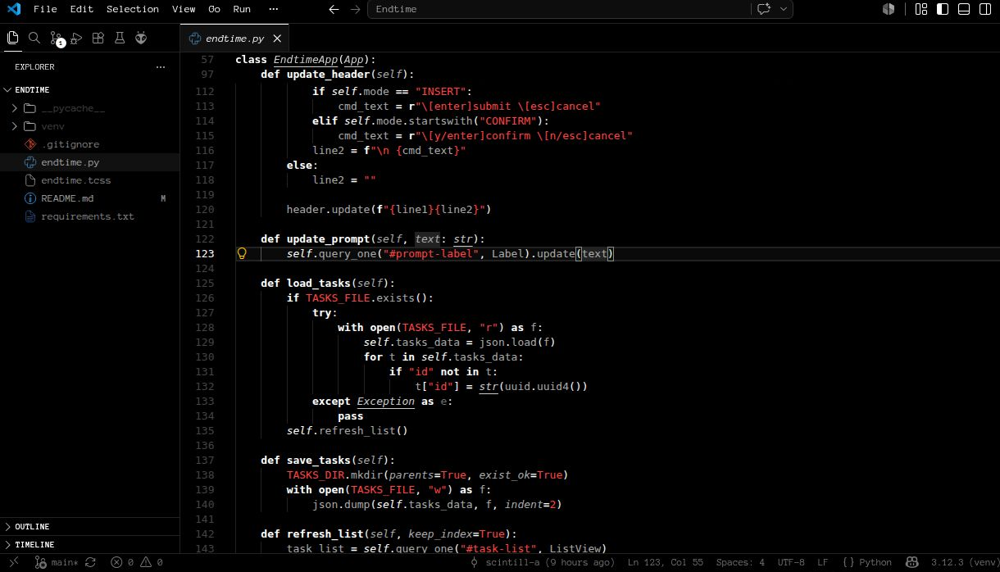

# Antares Theme

A minimal dark deep-space theme featuring true black backgrounds and high-contrast red accents inspired by the red supergiant star Antares.



## Features

- **Background:** True black (`#000000`)
- **Text:** Soft gray (`#777777`)
- **Highlights:** Bright white (`#ffffff`)
- **Accents:** Antares red (`#ff4444`)

## Installation

1. Copy the `antares-theme` folder into your extensions directory:
   - Linux: `~/.vscode/extensions/`
   - Windows: `%USERPROFILE%\.vscode\extensions\`
   - macOS: `~/.vscode/extensions/`
2. Reload your editor.
3. Select **Antares Theme** from the Color Theme menu.

### Neovim

Antares comes with a fully-featured, native Neovim colorscheme with integrations for popular plugins like Telescope, NvimTree, GitSigns, and CMP.

**Using [lazy.nvim](https://github.com/folke/lazy.nvim):**

```lua
{
  "scintill-a/antares-theme",
  lazy = false,
  priority = 1000,
  config = function()
    vim.cmd("colorscheme antares")
  end,
}
```

**Using [vim-plug](https://github.com/junegunn/vim-plug):**

```vim
Plug 'scintill-a/antares-theme'

" Add this somewhere in your init.vim
colorscheme antares
```

## License

[MIT](LICENSE)
